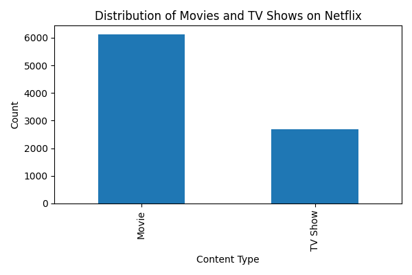
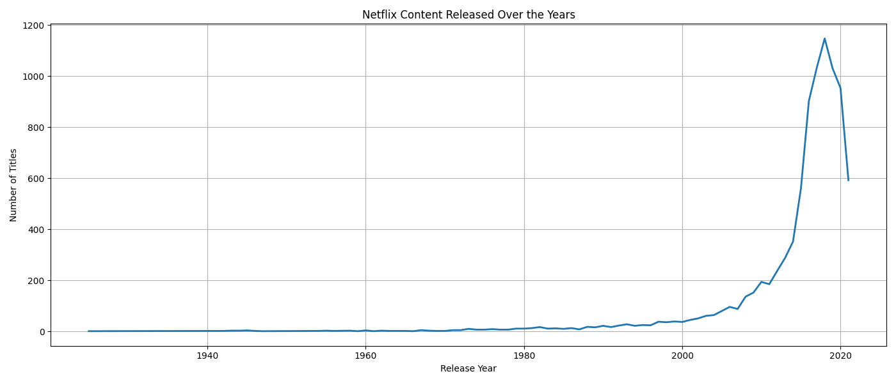
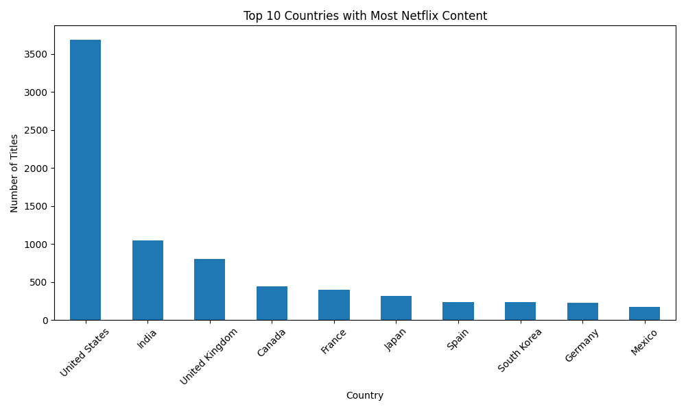
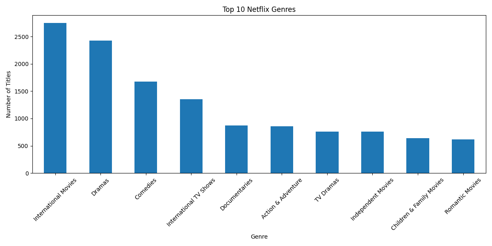
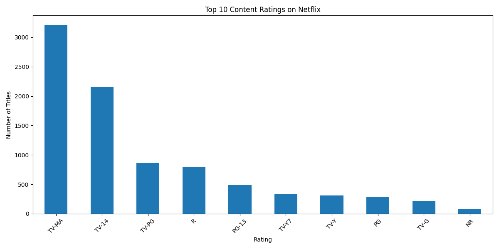
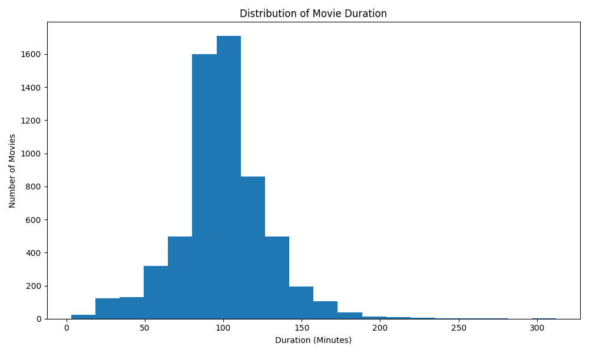
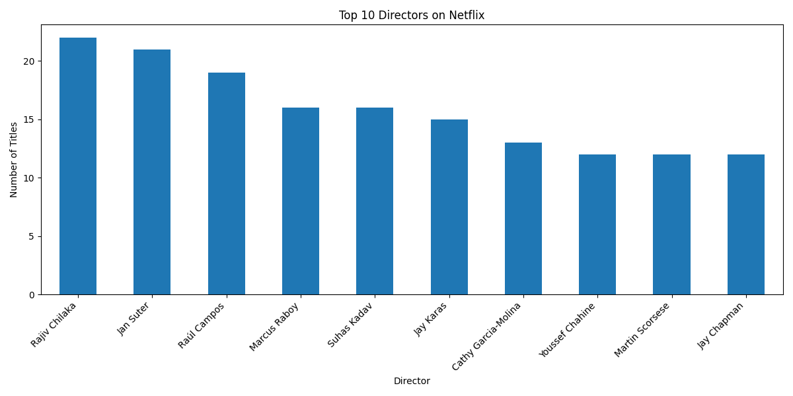
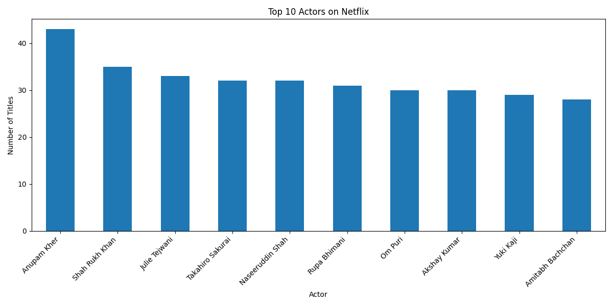

# 🎬 Netflix Movies & TV Shows Exploratory Data Analysis (EDA)


---

# 📌 Project Overview

This project performs **Exploratory Data Analysis (EDA)** on the Netflix Movies and TV Shows dataset.

The objective is to understand content distribution, release trends, countries, genres, ratings, directors, actors, and movie durations using Python.

The project demonstrates practical skills in:

- Data Cleaning
- Data Analysis
- Data Visualization
- Business Insight Generation

---

# 🎯 Business Problem

Netflix contains thousands of Movies and TV Shows.

The objective of this project is to answer questions like:

- Which content type is more popular?
- Which countries produce the most Netflix content?
- What are the most common genres?
- How has Netflix grown over the years?
- Which ratings dominate the platform?
- Which directors and actors appear the most?

---

# 🛠️ Tech Stack

- Python
- Pandas
- NumPy
- Matplotlib
- Jupyter Notebook

---

# 📂 Project Structure

```
Netflix-Media-EDA/
│
├── data/
│ └── netflix_titles.csv
│
├── notebook/
│ ├── Netflix_EDA.ipynb
│ └── Netflix_EDA.html
│
├── images/
│ ├── movies_vs_tvshows.png
│ ├── release_year_trend.png
│ ├── top10_countries.png
│ ├── top10_genres.png
│ ├── content_ratings.png
│ ├── movie_duration.png
│ ├── top_directors.png
│ ├── top_actors.png
│
├── report/
│ └── Project_Report.md
│
├── README.md
├── requirements.txt
└── .gitignore
```

---

# 📊 Visualizations

### Movies vs TV Shows



---

### Release Year Trend



---

### Top 10 Countries



---

### Top 10 Genres



---

### Content Ratings



---

### Movie Duration



---

### Top Directors



---

### Top Actors



---

# 📈 Key Insights

- Netflix has significantly more Movies than TV Shows.
- Content growth increased rapidly after 2015.
- United States contributes the highest number of titles.
- Drama and International Movies dominate the platform.
- TV-MA is the most common content rating.
- Movie duration is mostly between 80–120 minutes.
- Some directors and actors appear frequently across multiple titles.

---

# ▶️ How to Run

Clone the repository

```bash
git clone https://github.com/alishamansoori004-sketch/Netflix-Media-EDA.git
```

Go into the project folder

```bash
cd Netflix-Media-EDA
```

Install dependencies

```bash
pip install -r requirements.txt
```

Launch Jupyter Notebook

```bash
jupyter notebook
```

Open

```
notebook/Netflix_EDA.ipynb
```

---

# 📁 Dataset

Netflix Movies and TV Shows Dataset (Kaggle)

---

# 👩‍💻 Author

**Alisha Mansoori**

AI & Data Analytics Enthusiast

GitHub:
https://github.com/alishamansoori004-sketch

LinkedIn:
https://www.linkedin.com/in/alisha-mansoori-56041437a/?lipi=urn%3Ali%3Apage%3Ad_flagship3_feed%3BDH8zvVgMTriEZqPMZmhSuA%3D%3D

---

# ⭐ If you found this project useful

Please consider giving this repository a ⭐ on GitHub.
